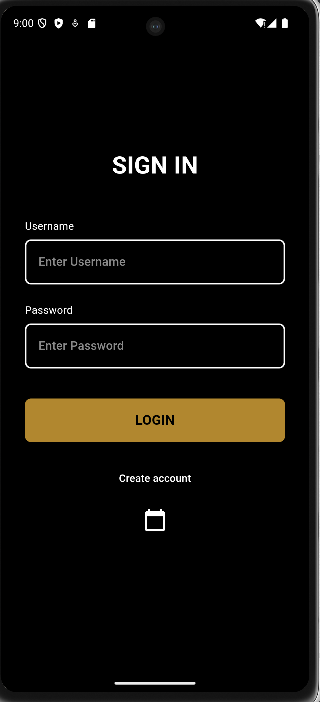
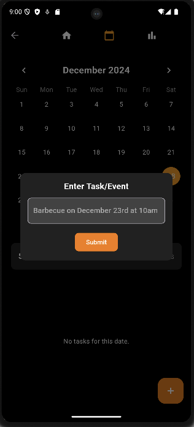
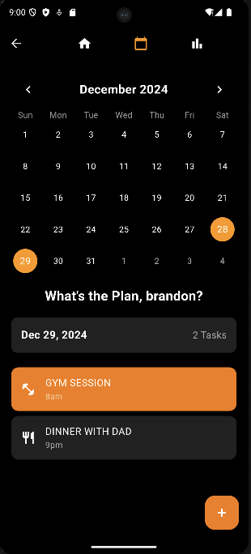
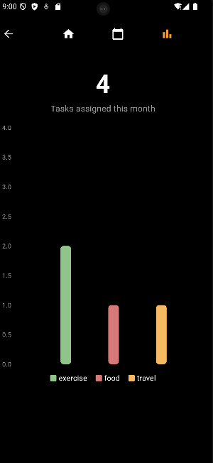

# NLP-Calendar-App

An intelligent calendar app powered by Natural Language Processing techniques relying on the spacy library, designed to organize your schedule seamlessly. Input event details as text, and it automatically adds them to your calendar. It also generates insightful charts to track and analyze your activity patterns. With a robust Python NLP backend hosted on Heroku, this app simplifies event management and helps you stay on top of your day.

This code is viewable for reference only and cannot be copied, modified, or redistributed without explicit permission.

